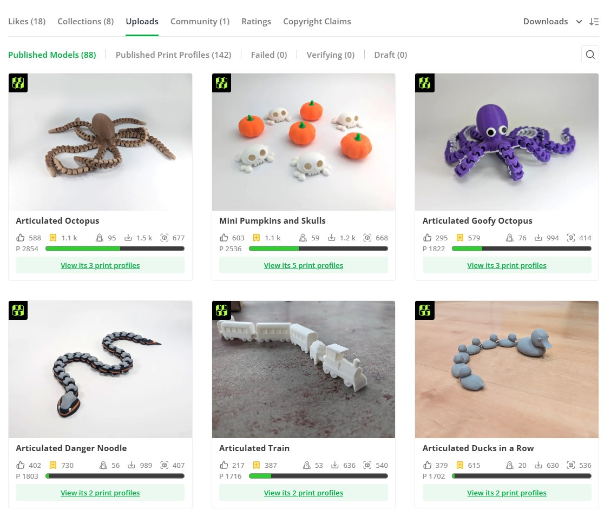

# MWPointTracker

MWPointTracker is a Chrome browser extension for MakerWorld creators that displays total of downloads and prints for each model on a maker's profile page. The formula used corresponds to NumberOfDownloads + NumberOfPrints * 2 and it's displayed on the web page next to the prints and download counters.

When a model is two events away from the next point reward, the total will be shown in orange. If it's one event away, it will be shown in red.

A progress bar is also added under the model statistics. The progress bar will show overall progress towards the next reward. If the mouse is held over the bar, the tooltip will show the number of current prints against the prints needed for the next reward.

The progress bar can be turned on or off by using the extensions options.

## Installation
MWPointTracker is now available [in the Chrome web store](https://chromewebstore.google.com/detail/cgehmglfpdcjmgngacemcabihfplgkki).

If you would rather install it from GitHub you can download this repo's contents and installing it in Chrome as an Unpacked Extension.

- Click the green `<> Code` button on this page and select `Download ZIP`.
- Extract the downloaded zip file to your preferred location.
- Open `chrome://extensions/` in your browser
- On upper-right corner, enabled 'Developer Mode'
- On the right side click the `Load unpacked` button. A file browser will open. Navigate the filesystem and select the mwpointtracker directory you extracted that contains the `manifest.json` file.

## Usage
Once it's loaded, MWPointTracker will work automatically whenever you visit a profile page on MakerWorld.

## Contact
ContributingFactor - cfactorprints@gmail.com
